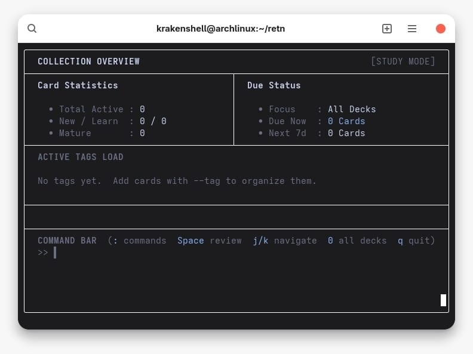

# retn — Terminal Spaced Repetition Engine



A minimal, keyboard-driven flashcard app for the terminal, built with C++20,
SQLite3, and [FTXUI](https://github.com/ArthurSonzogni/FTXUI).
Schedules reviews using the **FSRS v5** algorithm.

---

## Table of Contents

1. [Requirements & Build](#requirements--build)
2. [Running retn](#running-retn)
3. [Quick Start — First 5 Minutes](#quick-start--first-5-minutes)
4. [Dashboard](#dashboard)
5. [Adding Cards](#adding-cards)
6. [Review Session](#review-session)
7. [Tags & Filters](#tags--filters)
8. [Command Bar](#command-bar)
9. [Key Bindings Reference](#key-bindings-reference)
10. [Database & Backup](#database--backup)
11. [FSRS v5 Algorithm](#fsrs-v5-algorithm)
12. [Project Structure](#project-structure)

---

## Requirements & Build

### Dependencies

| Dependency  | Version              | Notes                         |
|-------------|----------------------|-------------------------------|
| GCC / Clang | GCC 12+ or Clang 15+ | C++20 required                |
| CMake       | ≥ 3.20               |                               |
| SQLite3     | system               | `sudo pacman -S sqlite`       |
| FTXUI       | automatic            | fetched by CMake FetchContent |

```bash
# Arch Linux
sudo pacman -S cmake sqlite gcc git

# Ubuntu / Debian
sudo apt install cmake libsqlite3-dev g++ git
```

### Build

```bash
git clone https://github.com/krakenshell-sh/retn.git
cd retn
cmake -B build -DCMAKE_BUILD_TYPE=Release
cmake --build build -j$(nproc)
```

The binary is at `build/retn`. No installation required.

### Run Tests

```bash
./build/test_fsrs       # FSRS algorithm unit tests
./build/test_database   # SQLite integration tests
```

---

## Running retn

```bash
# Default database: $HOME/.local/share/retn/retn.db
./build/retn

# Use a separate database per subject
./build/retn --db ~/study/calculus.db
./build/retn --db ~/study/english.db
```

The database is created automatically on first run.

---

## Quick Start — First 5 Minutes

### Step 1 — Open the app

```bash
./build/retn
```

You will see the Dashboard. All statistics show zero on a fresh database.

### Step 2 — Add your first card

Press `:` to open the Command Bar, then type:

```
add "What is the capital of Japan?" "Tokyo" --tag geography
```

Press `Enter`. The card is saved and the dashboard refreshes immediately.

For longer text, use the interactive form instead:

```
add --interactive
```

Fill in Question → press `Tab` → fill in Answer → press `Tab` → fill in Tags →
press `Ctrl+D` to save.

### Step 3 — Add a few more cards

```
add "What is H₂O?" "Water" --tag chemistry
add "Who invented the telephone?" "Alexander Graham Bell" --tag history
add "Integral of 2x?" "x² + C" --tag math
```

### Step 4 — Start a review

Press `Space` from the Dashboard. All new cards are due immediately.

- Cards appear one at a time
- Press `Space` to reveal the answer
- Rate your recall: `1` Again · `2` Hard · `3` Good · `4` Easy
- After all cards are reviewed, you return to the Dashboard automatically

### Step 5 — Come back tomorrow

retn only shows cards whose scheduled date has arrived. Cards rated **Easy**
reappear after many days; cards rated **Again** reappear in 1 minute.

---

## Dashboard

```
┌────────────────────────────────────────────────────────────────────────────┐
│  COLLECTION OVERVIEW                                        [STUDY MODE]   │
├──────────────────────────────────────┬─────────────────────────────────────┤
│  Card Statistics                     │  Due Status                         │
│    • Total Active : 47               │    • Focus    : All Decks           │
│    • New / Learn  : 5 / 3            │    • Due Now  : 12 Cards            │
│    • Mature       : 28               │    • Next 7d  : 31 Cards            │
├──────────────────────────────────────┴─────────────────────────────────────┤
│  ACTIVE TAGS LOAD                                                          │
│                                                                            │
│  [1] #geography   [ 3 due]         [3] #chemistry   [ 0 due]               │
│  [2] #history     [ 8 due]         [4] #math        [ 1 due]               │
│                                                                            │
├────────────────────────────────────────────────────────────────────────────┤
│  COMMAND BAR  (: commands  Space review  j/k navigate  0 all decks  q quit)│
│  >> _                                                                      │
└────────────────────────────────────────────────────────────────────────────┘
```

**Right panel:**

| Field       | Meaning                                                       |
|-------------|---------------------------------------------------------------|
| **Focus**   | Active filter. "All Decks" means no filter is set               |
| **Due Now** | Cards ready for review right now                              |
| **Next 7d** | Total cards due within the next 7 days (inclusive of Due Now) |

**Left panel:**

| Field            | Meaning                                            |
|------------------|----------------------------------------------------|
| **Total Active** | Total number of cards in the database              |
| **New / Learn**  | Cards never reviewed / cards in the learning phase |
| **Mature**       | Cards with stability ≥ 21 days (solidly memorized) |

**Tag list navigation:**

- `j` / `k` — move selection down / up
- `1` … `9` — jump directly to tag by number
- `Enter` — set filter to the selected tag
- `0` — clear filter, return to All Decks
- `Space` — start a review with the current filter

---

## Adding Cards

### Inline — via Command Bar (fast)

Press `:` and type:

```
add "Question" "Answer"
add "Question" "Answer" --tag tagname
```

Examples:

```
add "What does 'ephemeral' mean?" "Lasting a very short time; short-lived" --tag english
add "Area of a circle?" "πr²" --tag math
add "Define osmosis." "Movement of solvent through a semipermeable membrane from low to high solute concentration" --tag biology
```

Notes:
- Use `"quotes"` for text that contains spaces
- `--tag` accepts one tag per command; use the interactive form for multiple tags
- Tag names should not contain spaces or the `#` character

### Interactive Form — for long text or multiple tags

Press `:` then type `add --interactive` and press `Enter`.

```
┌────────────────────────────────────────────────────────────────────────────┐
│  ADD NEW CARD                              [Ctrl+D] Save   [Esc] Cancel    │
├────────────────────────────────────────────────────────────────────────────┤
│  Question :                                                                │
│ ┌──────────────────────────────────────────────────────────────────────┐   │
│ │ Explain the difference between mitosis and meiosis_                   │   │
│ └──────────────────────────────────────────────────────────────────────┘   │
│  Answer   :                                                                │
│ ┌──────────────────────────────────────────────────────────────────────┐   │
│ │ Mitosis: cell division for growth (2 identical daughter cells).      │   │
│ │ Meiosis: division for sexual reproduction (4 cells, half the         │   │
│ │ chromosome count).                                                   │   │
│ └──────────────────────────────────────────────────────────────────────┘   │
│  Tags     :                                                                │
│ ┌──────────────────────────────────────────────────────────────────────┐   │
│ │ biology cell-division final-exam_                                     │   │
│ └──────────────────────────────────────────────────────────────────────┘   │
└────────────────────────────────────────────────────────────────────────────┘
```

Form controls:

| Key         | Action                       |
|-------------|------------------------------|
| `Tab`       | Move to next field            |
| `Shift+Tab` | Move to previous field        |
| `Enter`     | New line (Answer field only)  |
| `Ctrl+D`    | **Save the card**            |
| `Esc`       | Cancel, return to Dashboard  |

**Tags field:** space-separated list, no `#` prefix required.
`biology cell-division final-exam` creates three tags: `#biology`, `#cell-division`, `#final-exam`.

---

## Review Session

### Question screen

```
┌────────────────────────────────────────────────────────────────────────────┐
│  REVIEWING: #math  (Card 3 of 8)                                           │
├────────────────────────────────────────────────────────────────────────────┤
│                                                                            │
│  Question:                                                                 │
│                                                                            │
│  Find the first derivative of f(x) = 3x³ − 2x² + 5x − 1                     │
│                                                                            │
├────────────────────────────────────────────────────────────────────────────┤
│  [Space] Show Answer                     [Esc] Main Menu   [:] Command     │
└────────────────────────────────────────────────────────────────────────────┘
```

Read the question, try to recall the answer, then press `Space`.

### Answer screen + Rating

```
┌────────────────────────────────────────────────────────────────────────────┐
│  REVIEWING: #math  (Card 3 of 8)                                           │
├────────────────────────────────────────────────────────────────────────────┤
│  Question:                                                                 │
│  Find the first derivative of f(x) = 3x³ − 2x² + 5x − 1                     │
├────────────────────────────────────────────────────────────────────────────┤
│                                                                            │
│  Answer:                                                                   │
│                                                                            │
│  f'(x) = 9x² − 4x + 5                                                      │
│                                                                            │
├────────────────────────────────────────────────────────────────────────────┤
│  [1] Again (1m)    [2] Hard (3d)    [3] Good (7d)    [4] Easy (18d)        │
└────────────────────────────────────────────────────────────────────────────┘
```

The time shown in parentheses is the **estimated next interval** if you pick that rating.

### Rating guide

| Key | Rating    | When to use                                           |
|-----|-----------|-------------------------------------------------------|
| `1` | **Again** | Completely forgot, or answered incorrectly            |
| `2` | **Hard**  | Remembered, but it took a long time or felt uncertain |
| `3` | **Good**  | Recalled with normal effort — use this when in doubt   |
| `4` | **Easy**  | Recalled instantly without any effort; felt trivial    |

> **Tip:** Don't be too generous with **Easy** — reserve it for cards that feel
> genuinely effortless. Overusing Easy reduces long-term retention.

### Exiting mid-session

Press `Esc` from either the Question or Answer screen to return to the Dashboard.
The current card **keeps its due date** — it will reappear next time.

Press `q` to quit the application. A confirmation dialog appears if a review
session is in progress.

---

## Tags & Filters

Tags group cards by topic, source, or exam. A card can have multiple tags.

### Set a filter from the tag list

Use `j`/`k` to navigate the tag list, then press `Enter`:

```
  [1] #geography   [ 3 due]         [3] #chemistry   [ 0 due]
  [2] #history     [ 8 due]  ← cursor here
```

Press `Enter` → filter changes to `#history`. The right panel updates:

```
  • Focus    : #history
  • Due Now  : 8 Cards
```

Press `Space` → review only `#history` cards.

### Set a filter via Command Bar

```
filter history       # set filter to #history
filter all           # clear filter, show all decks
```

### Number shortcuts

Press `2` directly from the Dashboard → selects tag number 2 and sets the filter.
Press `0` → clears the filter and returns to All Decks.

### Deleting a card

First find the card's ID using a SQLite query (see [Database & Backup](#database--backup)),
then from the Command Bar:

```
delete 7
```

A confirmation dialog appears. Press `y` to confirm, `n` to cancel.

---

## Command Bar

Press `:` on any screen to open the Command Bar. Press `Esc` to close it without
executing anything.

```
  >> _
```

### Full command reference

| Command                  | Description                              |
|--------------------------|------------------------------------------|
| `add "Q" "A"`            | Add a card inline                        |
| `add "Q" "A" --tag name` | Add a card with one tag                  |
| `add --interactive`      | Open the interactive three-field form     |
| `delete <id>`            | Delete a card by ID (shows confirmation)  |
| `filter <tag>`           | Set the study filter to a tag              |
| `filter all`             | Clear the filter, show all decks           |
| `help`                   | Show the in-app key binding reference    |

### Realistic examples

```
add "What does 'stoic' mean?" "Enduring pain without complaint" --tag english-vocab
add "Kinetic energy formula?" "Ek = ½mv²" --tag physics
filter final-exam
delete 42
add --interactive
```

---

## Key Bindings Reference

### Dashboard

| Key       | Action                             |
|-----------|------------------------------------|
| `Space`   | Start review (with current filter)  |
| `j` / `↓` | Move tag selection down            |
| `k` / `↑` | Move tag selection up              |
| `1` … `9` | Jump to tag N and set filter        |
| `Enter`   | Confirm selected tag as filter       |
| `0`       | Clear filter → All Decks            |
| `:`       | Open Command Bar                   |
| `q`       | Quit (with confirmation)            |

### Review — Question screen

| Key     | Action                               |
|---------|--------------------------------------|
| `Space` | Reveal the answer                    |
| `Esc`   | Return to Dashboard (card stays due) |
| `:`     | Open Command Bar                     |
| `q`     | Quit                                 |

### Review — Answer screen

| Key   | Action                            |
|-------|-----------------------------------|
| `1`   | Again — reappears in 1 minute     |
| `2`   | Hard — shorter interval than Good |
| `3`   | Good — optimal interval           |
| `4`   | Easy — longer interval            |
| `Esc` | Go back to the question           |
| `q`   | Quit                              |

### Interactive Add Form

| Key         | Action                       |
|-------------|------------------------------|
| `Tab`       | Next field                    |
| `Shift+Tab` | Previous field                |
| `Enter`     | New line (Answer field)       |
| `Ctrl+D`    | Save and return to Dashboard |
| `Esc`       | Cancel                       |

### Confirmation Dialogs (Quit / Delete)

| Key         | Action       |
|-------------|--------------|
| `y`         | Yes, proceed |
| `n` / `Esc` | No, cancel   |

---

## Database & Backup

The database is stored at `$HOME/.local/share/retn/retn.db`.

```bash
# Manual backup
cp ~/.local/share/retn/retn.db ~/backups/retn-$(date +%Y%m%d).db

# Inspect the database directly
sqlite3 ~/.local/share/retn/retn.db

# Useful queries
sqlite3 ~/.local/share/retn/retn.db \
  "SELECT id, question, state, reps, round(stability,1) FROM cards ORDER BY id;"

sqlite3 ~/.local/share/retn/retn.db \
  "SELECT tag_name, COUNT(*) AS total FROM tags GROUP BY tag_name ORDER BY total DESC;"

# Separate databases per subject
./build/retn --db ~/study/calculus.db
./build/retn --db ~/study/english.db
```

---

## FSRS v5 Algorithm

retn implements the FSRS v5 scheduler
([open-spaced-repetition/fsrs5](https://github.com/open-spaced-repetition/fsrs5)).

**Core concepts:**

| Symbol                    | Meaning                                                     |
|---------------------------|-------------------------------------------------------------|
| **S** (Stability)         | Days until retrievability drops to 90%                      |
| **D** (Difficulty)          | 1 (easy) to 10 (hard); adjusted each review                 |
| **R(t)** (Retrievability) | `exp(ln(0.9) × t / S)` — probability of recall after t days |

**New card scheduling** (aligned with Py-FSRS reference):

| Rating | State →  | Next Review                            |
|--------|----------|----------------------------------------|
| Again  | Learning | + 1 minute                             |
| Hard   | Learning | + 10 minutes                           |
| Good   | Review   | + 1 day (fixed)                         |
| Easy   | Review   | + S₀ days (~15 d with default weights) |

**Review card scheduling:**

| Rating             | Effect                                                          |
|--------------------|----------------------------------------------------------------|
| Again              | Forgetting formula resets stability; Relearning state, +10 min |
| Hard / Good / Easy | Recall formula grows stability; next interval ≈ new S          |

**Interval formula:**

```
I = round(S × ln(Rd) / ln(0.9))
```

At the default target retention `Rd = 0.90`, this simplifies to `round(S)`.
Changing `DESIRED_RETENTION` in `src/db/fsrs.h` adjusts all intervals.

**Default weights:** FSRS v5 reference weights from `open-spaced-repetition/fsrs5`.
The 19-parameter array is defined in `src/db/fsrs.h` and can be replaced with
user-trained weights from the FSRS optimizer.

---

## Project Structure

```
retn/
├── CMakeLists.txt
├── assets/
│   └── schema.sql           SQLite schema (cards + tags tables)
├── src/
│   ├── main.cpp             Entry point, CLI argument parsing
│   ├── app/
│   │   ├── application.h/cpp   State machine, event loop, screen routing
│   │   └── config.h/cpp        Database path resolution
│   ├── db/
│   │   ├── database.h/cpp      SQLite wrapper — CRUD, stats, tag queries
│   │   └── fsrs.h/cpp          FSRS v5 scheduler
│   ├── ui/
│   │   ├── components.h/cpp    Shared FTXUI primitives and colour palette
│   │   ├── dashboard.h/cpp     Dashboard screen renderer
│   │   ├── review.h/cpp        Question and Answer screen renderers
│   │   ├── adder.h/cpp         Interactive card-add form
│   │   └── command_bar.h/cpp   Overlay dialogs (help, delete confirm, quit confirm)
│   └── cli/
│       └── cli_parser.h/cpp    Command string tokenizer and parser
└── tests/
    ├── test_fsrs.cpp           FSRS unit tests (43 assertions)
    └── test_database.cpp       SQLite integration tests (23 assertions)
```

---

## License

MIT
